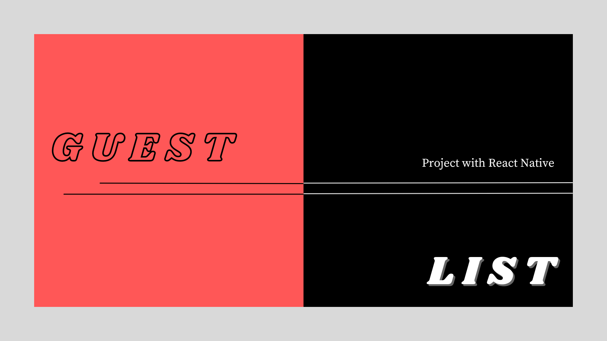

# Website Template: Exploring the Magical World of Harry Potter
DevLinks Website Template inspired by Harry Potter. Created based on the Rocketseat course and further enhanced by me.

  ##
  
## Overview
Projeto simples utilizando React Native com o Expo e TypesScript para cadastrar os convidados do seu evento.

## How to View
Abra o arquivo pelo `Expo Go` no seu smartphone.

## Technologies Used
- `React Native e Expo`
- `TypesScript`
- `Git e Github`

## File Structure
App.tsx
index.tsx
style.ts

# License
This project is licensed under the MIT License.

# Contributions
Contributions are always welcome! You're invited to submit any improvements or corrections.

# Credits
Crafted with care by Julia Faria, supported by Rocketseat.

# Guest List

Aplicativo onde é possível "cadastrar" os convidados de um determinado evento.

## :thought_balloon: Visão Geral

Projeto simples utilizando React Native com o Expo e TypesScript para cadastrar os convidados do seu evento.

## :eyes: Como Visualizar

Abra o arquivo pelo `Expo Go` no seu smartphone.

## :computer: Tecnologias

Esse projeto foi desenvolvido com as seguintes tecnologias:

- React Native e Expo
- TypesScript
- Git e Github

## :grey_exclamation: Estrutura de Arquivos
├── App.tsx

├── index.tsx

└── style.ts

## :memo: Licença

Esse projeto está sob a licença MIT.

## :love_letter: Contribuição

Contribuições são sempre bem-vindas!

## :v: Créditos

Feito com muito ♥ by Julia Faria :wave:
